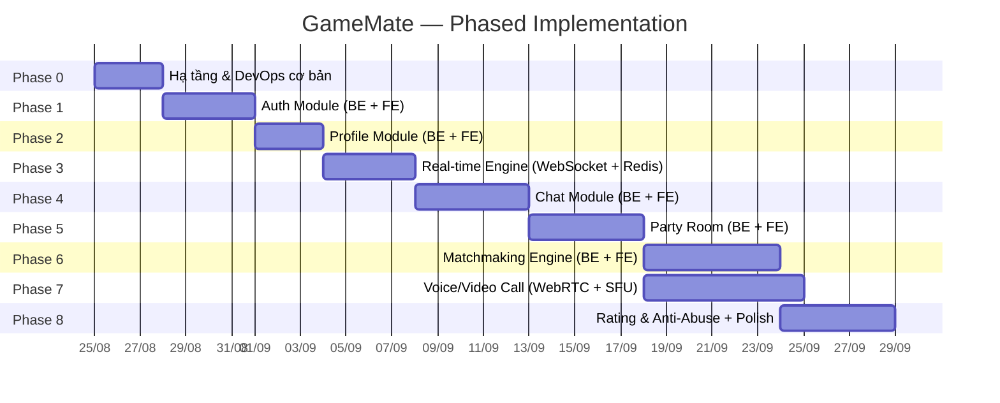

# 🎮 Kế Hoạch Triển Khai GameMate — Từng Bước Từ Đầu

## Tổng Quan

Dự án hiện tại chỉ có **scaffold rỗng** (toàn bộ file `.go`, `.tsx`, `.json` đều chưa có nội dung). Kế hoạch dưới đây chia việc triển khai thành **8 Phase** theo đúng thứ tự phụ thuộc — mỗi phase xây trên nền tảng phase trước, đảm bảo luôn có sản phẩm chạy được sau mỗi phase.



> [!IMPORTANT]
> **Nguyên tắc xuyên suốt**: Mỗi phase kết thúc bằng một bản chạy được (runnable). Viết test song song với code, không để dồn cuối. Commit thường xuyên, mỗi commit phải build pass.

---

## Phase 0 — Hạ Tầng & DevOps Cơ Bản (~3 ngày)

**Mục tiêu**: Chạy được `docker-compose up` để khởi động toàn bộ stack (Go server + PostgreSQL + Redis + MinIO) và `npm run dev` cho frontend.

### Backend

#### [MODIFY] [go.mod](file:///d:/projects/game_mate/backend/go.mod)
- Khởi tạo Go module: `go mod init github.com/<username>/gamemate`
- Thêm dependencies cốt lõi:
  - Web framework: `github.com/gin-gonic/gin`
  - PostgreSQL driver: `github.com/jackc/pgx/v5`
  - Redis client: `github.com/redis/go-redis/v9`
  - Logger: `go.uber.org/zap`
  - Config: `github.com/spf13/viper`
  - Migrate: `github.com/golang-migrate/migrate/v4`

#### [MODIFY] [main.go](file:///d:/projects/game_mate/backend/cmd/server/main.go)
- Load config → Init logger → Connect DB → Connect Redis → Init Gin router → Healthcheck endpoint (`GET /api/health`) → Start server

#### `pkg/` — Shared packages
| File | Nội dung |
|---|---|
| [config/](file:///d:/projects/game_mate/backend/pkg/config) | Load từ `.env` / environment variables qua Viper |
| [database/](file:///d:/projects/game_mate/backend/pkg/database) | `NewPostgresPool()` — connection pool pgxpool, auto-migrate |
| [redis/](file:///d:/projects/game_mate/backend/pkg/redis) | `NewRedisClient()` — kết nối Redis |
| [logger/](file:///d:/projects/game_mate/backend/pkg/logger) | `NewLogger()` — Zap structured logger |

#### [MODIFY] [docker-compose.yml](file:///d:/projects/game_mate/backend/deployments/docker-compose.yml)
- Services: `postgres` (5432), `redis` (6379), `minio` (9000/9001), `backend` (8080)
- Volumes cho persistent data
- `.env` file mẫu

#### [MODIFY] [Dockerfile](file:///d:/projects/game_mate/backend/deployments/Dockerfile)
- Multi-stage build: build Go binary → Alpine runtime image

### Frontend

#### [MODIFY] [package.json](file:///d:/projects/game_mate/frontend/package.json)
- Khởi tạo Next.js project:
  - `next`, `react`, `react-dom`, `typescript`
  - `@types/react`, `@types/node`
  - `tailwindcss` (nếu user chọn), hoặc vanilla CSS
  - `zustand` (state management)
  - `axios` (HTTP client)

#### [MODIFY] [next.config.js](file:///d:/projects/game_mate/frontend/next.config.js)
- Cấu hình proxy API sang backend (`rewrites` hoặc env `NEXT_PUBLIC_API_URL`)

#### [MODIFY] [layout.tsx](file:///d:/projects/game_mate/frontend/app/layout.tsx)
- Root layout với metadata, font, global styles

### Deliverables Phase 0
- [ ] `docker-compose up` khởi động được Postgres + Redis + MinIO + Backend
- [ ] `GET /api/health` trả về `{"status": "ok"}`
- [ ] `npm run dev` chạy được Next.js trên `localhost:3000`
- [ ] Logger structured output ra console

---

## Phase 1 — Auth Module (~4 ngày)

**Mục tiêu**: Đăng ký, đăng nhập, JWT access/refresh token, middleware bảo vệ route.

### Backend — `internal/auth/`

| File | Nội dung |
|---|---|
| [model.go](file:///d:/projects/game_mate/backend/internal/auth/model.go) | `User` struct, `RegisterRequest`, `LoginRequest`, `TokenPair`, `Claims` |
| [repository.go](file:///d:/projects/game_mate/backend/internal/auth/repository.go) | `CreateUser()`, `GetUserByEmail()`, `GetUserByID()` — thao tác trực tiếp với PostgreSQL |
| [service.go](file:///d:/projects/game_mate/backend/internal/auth/service.go) | `Register()` (hash bcrypt + insert), `Login()` (verify + sign JWT), `RefreshToken()`, `ValidateToken()` |
| [handler.go](file:///d:/projects/game_mate/backend/internal/auth/handler.go) | `POST /api/auth/register`, `POST /api/auth/login`, `POST /api/auth/refresh`, `GET /api/auth/me` |

#### [NEW] `internal/middleware/auth.go`
- Gin middleware: Extract Bearer token → Validate JWT → Inject `userID` vào context
- Áp dụng cho tất cả route cần xác thực

#### `migrations/`
- `001_create_users_table.up.sql` / `.down.sql`

### Frontend

| File | Nội dung |
|---|---|
| [lib/api.ts](file:///d:/projects/game_mate/frontend/lib/api.ts) | Axios instance, interceptor tự gắn JWT, auto-refresh khi 401 |
| [lib/auth.ts](file:///d:/projects/game_mate/frontend/lib/auth.ts) | `login()`, `register()`, `logout()`, lưu token vào `localStorage` |
| [store/](file:///d:/projects/game_mate/frontend/store) | Zustand store: `useAuthStore` (user, token, isAuthenticated) |
| [(auth)/login/page.tsx](file:///d:/projects/game_mate/frontend/app/(auth)/login) | Form đăng nhập (email + password) |
| [(auth)/register/page.tsx](file:///d:/projects/game_mate/frontend/app/(auth)/register) | Form đăng ký (display_name + email + password + confirm) |

### Deliverables Phase 1
- [ ] Đăng ký tài khoản → lưu vào DB (password hashed bcrypt)
- [ ] Đăng nhập → nhận access_token + refresh_token
- [ ] Middleware reject request không có/hoặc hết hạn JWT
- [ ] Refresh token flow hoạt động
- [ ] Frontend: form login/register → redirect khi thành công
- [ ] Unit test: service layer (register, login, token validation)

---

## Phase 2 — Profile Module (~3 ngày)

**Mục tiêu**: CRUD hồ sơ gamer với rank JSONB linh hoạt theo game; auto-load profile khi đăng nhập lại.

### Backend — `internal/profile/`

| File | Nội dung |
|---|---|
| [model.go](file:///d:/projects/game_mate/backend/internal/profile/model.go) | `GameProfile` struct: `game_name`, `rank_data (JSONB)`, `play_goal`, `available_hours (JSONB)`, `languages` |
| [repository.go](file:///d:/projects/game_mate/backend/internal/profile/repository.go) | `CreateProfile()`, `GetProfilesByUserID()`, `UpdateProfile()`, `DeleteProfile()` |
| [service.go](file:///d:/projects/game_mate/backend/internal/profile/service.go) | Validation logic (rank_data format theo game), business rules |
| [handler.go](file:///d:/projects/game_mate/backend/internal/profile/handler.go) | `POST /api/profiles`, `GET /api/profiles/me`, `PUT /api/profiles/:id`, `DELETE /api/profiles/:id` |

#### `migrations/`
- `002_create_game_profiles_table.up.sql` — cột `rank_data JSONB`, `available_hours JSONB`

### Frontend

| File | Nội dung |
|---|---|
| [(main)/profile/page.tsx](file:///d:/projects/game_mate/frontend/app/(main)/profile) | Form thiết lập hồ sơ gamer: chọn game → hiển thị rank picker tương ứng |
| [types/](file:///d:/projects/game_mate/frontend/types) | `GameProfile`, `RankData`, `GameConfig` interfaces |

#### [NEW] `frontend/lib/gameConfig.ts`
- Map cấu hình rank theo từng game:
```typescript
const GAME_CONFIGS = {
  "lmht": { ranks: ["Sắt", "Đồng", "Bạc", "Vàng", "Bạch Kim", "Ngọc Lục Bảo", "Kim Cương", "Cao Thủ", "Đại Cao Thủ", "Thách Đấu"], divisions: ["IV","III","II","I"] },
  "valorant": { ranks: ["Iron", "Bronze", "Silver", "Gold", "Platinum", "Diamond", "Ascendant", "Immortal", "Radiant"], divisions: ["1","2","3"] },
  // ...
}
```

### Deliverables Phase 2
- [ ] CRUD game profile với rank_data JSONB
- [ ] GET `/api/profiles/me` auto-load khi đăng nhập
- [ ] Frontend: form chọn game → dynamic rank picker → submit
- [ ] Unit test: repository + service layer

---

## Phase 3 — Real-time Engine (~4 ngày)

**Mục tiêu**: WebSocket Hub quản lý kết nối, Redis Pub/Sub fanout giữa nhiều instance, Presence system.

> [!IMPORTANT]
> Đây là **hạ tầng nền tảng** cho Chat (Phase 4), Party Room (Phase 5), Matchmaking notifications (Phase 6), và Signaling (Phase 7). Cần thiết kế kỹ protocol từ đầu.

### Backend — `internal/realtime/`

| File | Nội dung |
|---|---|
| [protocol.go](file:///d:/projects/game_mate/backend/internal/realtime/protocol.go) | Định nghĩa format message JSON: `{ "type": "chat.message" \| "presence.update" \| "match.found" \| ..., "payload": {...} }` |
| [client.go](file:///d:/projects/game_mate/backend/internal/realtime/client.go) | `Client` struct: quản lý 1 WS connection (readPump, writePump goroutines) |
| [hub.go](file:///d:/projects/game_mate/backend/internal/realtime/hub.go) | `Hub` struct: quản lý tất cả active clients, register/unregister, broadcast to room/user |
| [pubsub.go](file:///d:/projects/game_mate/backend/internal/realtime/pubsub.go) | Redis Pub/Sub: publish message → tất cả instance subscribe → forward tới local clients |

#### WebSocket Endpoint
- `GET /api/ws` — upgrade HTTP → WebSocket, xác thực JWT trong query param hoặc first message

#### Presence
- Lưu user status trong Redis với TTL heartbeat (30s)
- Client gửi ping định kỳ → server renew TTL
- Khi TTL hết → publish `presence.offline` event

### Frontend

| File | Nội dung |
|---|---|
| [lib/websocket.ts](file:///d:/projects/game_mate/frontend/lib/websocket.ts) | WebSocket singleton: auto-connect, auto-reconnect với exponential backoff, message dispatcher |
| [hooks/useWebSocket.ts](file:///d:/projects/game_mate/frontend/hooks/useWebSocket.ts) | React hook: subscribe theo event type, cleanup on unmount |
| [hooks/usePresence.ts](file:///d:/projects/game_mate/frontend/hooks/usePresence.ts) | Hook theo dõi trạng thái online/offline bạn bè |

### Deliverables Phase 3
- [ ] WebSocket kết nối được với JWT auth
- [ ] Hub quản lý register/unregister client
- [ ] Redis Pub/Sub fanout message giữa nhiều instance (test bằng 2 instance backend)
- [ ] Presence: online/offline detection với heartbeat
- [ ] Frontend: WebSocket auto-connect + auto-reconnect
- [ ] Integration test: 2 client gửi nhận message qua Hub

---

## Phase 4 — Chat Module (~5 ngày)

**Mục tiêu**: Chat 1-1 (DM) và group chat real-time, lịch sử chat với cursor-based pagination, typing indicator.

### Backend — `internal/chat/`

| File | Nội dung |
|---|---|
| [model.go](file:///d:/projects/game_mate/backend/internal/chat/model.go) | `Conversation` (type: direct/party), `Message` (content, type: text/image/system, sender_id) |
| [repository.go](file:///d:/projects/game_mate/backend/internal/chat/repository.go) | `CreateConversation()`, `SaveMessage()`, `GetMessages()` (cursor-based), `GetConversations()` |
| [service.go](file:///d:/projects/game_mate/backend/internal/chat/service.go) | Logic gửi tin nhắn: validate → save DB → publish Redis → broadcast qua Hub |
| [handler.go](file:///d:/projects/game_mate/backend/internal/chat/handler.go) | REST: `GET /api/conversations`, `GET /api/conversations/:id/messages?cursor=...`; WS events: `chat.send`, `chat.typing` |

#### `migrations/`
- `003_create_conversations_table.up.sql`
- `004_create_messages_table.up.sql` — index trên `(conversation_id, created_at)` cho cursor pagination

### Frontend

| File | Nội dung |
|---|---|
| [components/chat/ConversationList.tsx](file:///d:/projects/game_mate/frontend/components/chat/ConversationList.tsx) | Danh sách hội thoại, hiển thị tin nhắn cuối + unread count |
| [components/chat/MessageList.tsx](file:///d:/projects/game_mate/frontend/components/chat/MessageList.tsx) | Danh sách tin nhắn, infinite scroll load thêm (cursor pagination) |
| [components/chat/MessageInput.tsx](file:///d:/projects/game_mate/frontend/components/chat/MessageInput.tsx) | Ô nhập tin nhắn, emit typing event khi đang gõ |
| [(main)/chat/page.tsx](file:///d:/projects/game_mate/frontend/app/(main)/chat) | Trang chat: sidebar conversations + main message area |
| [(main)/chat/[id]/page.tsx](file:///d:/projects/game_mate/frontend/app/(main)/chat) | Chi tiết 1 conversation |

### Deliverables Phase 4
- [ ] Tạo conversation DM giữa 2 user
- [ ] Gửi/nhận tin nhắn real-time qua WebSocket
- [ ] Lịch sử chat với cursor-based pagination
- [ ] Typing indicator hiển thị khi đang gõ
- [ ] Gửi ảnh (upload qua Storage module → gắn URL vào message)
- [ ] Frontend: giao diện chat hoàn chỉnh

---

## Phase 5 — Party Room (~5 ngày)

**Mục tiêu**: Tạo/join/leave room, lifecycle management (waiting → in_game → closed), group chat trong room.

### Backend — `internal/party/`

| File | Nội dung |
|---|---|
| [model.go](file:///d:/projects/game_mate/backend/internal/party/model.go) | `Party` (name, game_name, visibility, max_members, status, closed_at), `PartyMember` (role: host/member) |
| [repository.go](file:///d:/projects/game_mate/backend/internal/party/repository.go) | CRUD Party + Members, query public rooms, update status |
| [service.go](file:///d:/projects/game_mate/backend/internal/party/service.go) | `CreateRoom()`, `JoinRoom()`, `LeaveRoom()`, `CloseRoom()` — xử lý lifecycle + tạo conversation cho room + giải phóng tài nguyên khi đóng |
| [handler.go](file:///d:/projects/game_mate/backend/internal/party/handler.go) | `POST /api/parties`, `POST /api/parties/:id/join`, `POST /api/parties/:id/leave`, `GET /api/parties` (browse public), `PATCH /api/parties/:id/status` |

#### `migrations/`
- `005_create_parties_table.up.sql` — status enum, closed_at nullable
- `006_create_party_members_table.up.sql`

### Frontend

| File | Nội dung |
|---|---|
| [components/party/RoomBrowser.tsx](file:///d:/projects/game_mate/frontend/components/party/RoomBrowser.tsx) | Danh sách phòng public: filter theo game, hiển thị trạng thái + số slot còn trống |
| [components/party/PartyMemberList.tsx](file:///d:/projects/game_mate/frontend/components/party/PartyMemberList.tsx) | Danh sách thành viên trong room, hiển thị role + presence |
| [(main)/find-teammate/page.tsx](file:///d:/projects/game_mate/frontend/app/(main)/find-teammate) | Trang browse room + nút Quick Match |
| [(main)/party/[roomId]/page.tsx](file:///d:/projects/game_mate/frontend/app/(main)/party) | Giao diện room: member list + chat + (sau này) voice/video |

### Deliverables Phase 5
- [ ] Tạo room public/private, join bằng link/mã mời
- [ ] Leave room, host có thể giải tán phòng
- [ ] Lifecycle: `waiting` → `in_game` → `closed` chuyển đổi đúng
- [ ] Khi `closed`: cleanup WS connections của room, record vẫn giữ trong DB
- [ ] Group chat trong room (reuse Chat module, link conversation ↔ party)
- [ ] Frontend: browse rooms + room detail page
- [ ] Real-time cập nhật danh sách member khi có người join/leave

---

## Phase 6 — Matchmaking Engine (~6 ngày)

**Mục tiêu**: Thuật toán Slot Filling, Redis queue, background worker, kịch bản solo + nhóm bạn bè tìm thêm slot.

> [!IMPORTANT]
> Đây là **module phức tạp nhất** của project — cần thiết kế kỹ thuật toán matching và xử lý concurrent (race conditions khi nhiều worker cùng ghép).

### Backend — `internal/matchmaking/`

| File | Nội dung |
|---|---|
| [handler.go](file:///d:/projects/game_mate/backend/internal/matchmaking/handler.go) | `POST /api/matchmaking/join` (tham gia queue), `POST /api/matchmaking/cancel` (hủy tìm), `GET /api/matchmaking/status` |
| [service.go](file:///d:/projects/game_mate/backend/internal/matchmaking/service.go) | Điều phối: validate tiêu chí → push vào queue → theo dõi trạng thái |
| [queue.go](file:///d:/projects/game_mate/backend/internal/matchmaking/queue.go) | Redis operations: `EnqueueRequest()`, `DequeueRequest()`, `GetPendingRequests()` — quản lý queue theo bucket (game + rank range) |
| [worker.go](file:///d:/projects/game_mate/backend/internal/matchmaking/worker.go) | Background goroutine: quét queue định kỳ (mỗi 2-3s), chạy thuật toán Slot Filling, tạo room + gửi notification |

#### Thuật toán Slot Filling (trong `worker.go`)
```
1. Lấy tất cả pending requests trong cùng bucket (game + rank range tương thích)
2. Sắp xếp theo thời gian chờ (ưu tiên người chờ lâu nhất)
3. Greedy fill: 
   - Lấy request đầu tiên (có thể là nhóm 3 người)
   - Tính slots_needed = target_team_size - group_size
   - Tìm combination các request khác sao cho tổng group_size = slots_needed
   - Nếu tìm được → đánh dấu matched, tạo Party Room
4. Xử lý concurrent: dùng Redis WATCH/MULTI hoặc Lua script để đảm bảo atomic
```

#### `migrations/`
- `007_create_matchmaking_requests_table.up.sql` — `group_size`, `target_team_size`, `party_id` nullable

#### WebSocket Events
- `match.found` → client hiển thị modal Accept/Decline (countdown 30s)
- `match.accepted` / `match.declined` → server xử lý kết quả
- `match.timeout` → trả request về queue

### Frontend

| File | Nội dung |
|---|---|
| [components/matchmaking/FilterPanel.tsx](file:///d:/projects/game_mate/frontend/components/matchmaking/FilterPanel.tsx) | Bộ lọc: chọn game, rank range, mục tiêu, khung giờ |
| [components/matchmaking/QuickMatchButton.tsx](file:///d:/projects/game_mate/frontend/components/matchmaking/QuickMatchButton.tsx) | Nút Quick Match: hiển thị trạng thái đang tìm + thời gian chờ + nút hủy |
| [components/matchmaking/MatchFoundModal.tsx](file:///d:/projects/game_mate/frontend/components/matchmaking/MatchFoundModal.tsx) | Modal khi tìm được match: hiển thị đồng đội + countdown Accept/Decline |
| [hooks/useMatchmaking.ts](file:///d:/projects/game_mate/frontend/hooks/useMatchmaking.ts) | Hook quản lý state matchmaking: idle → searching → found → accepted/declined |

### Deliverables Phase 6
- [ ] Solo queue: 1 user bấm Quick Match → worker ghép đủ team → tạo room
- [ ] Group queue: nhóm 3 trong Party Room bấm tìm thêm 2 → worker ghép thêm 2 solo/nhóm 2
- [ ] Accept/Decline flow với countdown 30s
- [ ] Timeout → trả về queue
- [ ] Xử lý race condition (không ghép 1 user vào 2 room cùng lúc)
- [ ] Frontend: filter → quick match → modal accept → redirect vào room
- [ ] Unit test: thuật toán slot filling với nhiều kịch bản

---

## Phase 7 — Voice/Video Call & WebRTC (~7 ngày)

**Mục tiêu**: Signaling server, voice call trong room, video call kèm screen share, STUN/TURN setup.

> [!NOTE]
> Phase này có thể triển khai **song song** với Phase 6 vì phụ thuộc chính là Phase 5 (Party Room).

### Backend — `internal/call/`

| File | Nội dung |
|---|---|
| [signaling.go](file:///d:/projects/game_mate/backend/internal/call/signaling.go) | WebSocket handler cho WebRTC signaling: relay SDP offer/answer, ICE candidates giữa các peer trong cùng room |
| [room.go](file:///d:/projects/game_mate/backend/internal/call/room.go) | Quản lý call session: tạo call record, track participants join/leave, cleanup khi room closed |
| [sfu.go](file:///d:/projects/game_mate/backend/internal/call/sfu.go) | Tích hợp Pion WebRTC SFU: nhận stream từ mỗi client → forward tới các client còn lại |

#### Dependencies bổ sung
- `github.com/pion/webrtc/v4` — Go WebRTC implementation
- coturn container trong docker-compose cho STUN/TURN

#### `migrations/`
- `008_create_calls_table.up.sql`
- `009_create_call_participants_table.up.sql`

#### WebSocket Events (signaling)
- `call.join` / `call.leave`
- `call.offer` / `call.answer` / `call.ice-candidate`
- `call.mute` / `call.unmute`
- `call.speaking` (voice activity indicator)

### Frontend

| File | Nội dung |
|---|---|
| [lib/webrtc.ts](file:///d:/projects/game_mate/frontend/lib/webrtc.ts) | WebRTC helper: tạo `RTCPeerConnection`, quản lý local/remote streams, ICE candidates |
| [hooks/useWebRTC.ts](file:///d:/projects/game_mate/frontend/hooks/useWebRTC.ts) | Hook quản lý: mic on/off, camera on/off, screen share, voice activity detection |
| [components/party/VoiceChannel.tsx](file:///d:/projects/game_mate/frontend/components/party/VoiceChannel.tsx) | UI voice channel: danh sách người đang trong call, viền sáng quanh avatar khi nói, nút mute |
| [components/party/VideoGrid.tsx](file:///d:/projects/game_mate/frontend/components/party/VideoGrid.tsx) | Grid hiển thị video streams (2x2, 3x2...) + nút screen share |

### Deliverables Phase 7
- [ ] Signaling: 2 client trao đổi SDP/ICE qua WebSocket → kết nối P2P thành công
- [ ] Voice call nhóm nhỏ (≤4): mesh network
- [ ] Voice activity detection → viền sáng avatar
- [ ] Mute/unmute mic
- [ ] Video call qua SFU (Pion) cho group lớn hơn
- [ ] Screen share
- [ ] STUN/TURN (coturn) hoạt động cho NAT traversal
- [ ] Cleanup: ngắt stream + call record khi room closed
- [ ] Frontend: VoiceChannel + VideoGrid tích hợp trong Party Room page

---

## Phase 8 — Rating, Anti-Abuse & Polish (~5 ngày)

**Mục tiêu**: Hệ thống đánh giá đồng đội tự nguyện, cơ chế chống lạm dụng 3 tầng, notification, storage, và polish tổng thể.

### Backend — `internal/rating/`

| File | Nội dung |
|---|---|
| [handler.go](file:///d:/projects/game_mate/backend/internal/rating/handler.go) | `POST /api/ratings` (submit rating), `GET /api/ratings/user/:id` (xem rating trung bình + tags) |
| [service.go](file:///d:/projects/game_mate/backend/internal/rating/service.go) | Submit rating → **Anti-abuse pipeline**: Anomaly Detection → Cross-Check → áp dụng weight từ rater_reputation → lưu kết quả |

#### Anti-Abuse Pipeline (chi tiết `service.go`)
```
1. ANOMALY DETECTION:
   - Lấy average score lịch sử của rated_user
   - Nếu |new_score - avg| > threshold (vd: 3 điểm) → đánh nhãn status = "anomaly"
   
2. CROSS-CHECK (chạy async sau khi tất cả rating trong cùng party hoàn tất):
   - Nếu 3+ người đánh giá user B tốt (≥4★), chỉ có A đánh giá tệ (≤2★) → reject rating của A
   
3. SHADOW PENALTY:
   - Cập nhật rater_reputation: tăng anomaly_count
   - Nếu anomaly_count / total_ratings_given > 30% → giảm rating_weight dần về 0
   - Tất cả rating tương lai của rater sẽ áp weight thấp (user không biết)
```

#### `migrations/`
- `010_create_teammate_ratings_table.up.sql` — status, weight columns
- `011_create_rater_reputation_table.up.sql`

### Backend — `internal/notification/`
- Push notification qua WebSocket: `match.found`, `party.invite`, `rating.reminder`

### Backend — `internal/storage/`
- Upload avatar/ảnh → MinIO/S3
- `POST /api/upload`, trả về URL

### Frontend
- Màn hình kết thúc sau khi room closed: cards đồng đội + tag icons (1-click) + nút "Bỏ qua" + auto-close 15s
- Profile page: hiển thị average rating + top tags + badge
- Notification dropdown/toast

### Deliverables Phase 8
- [ ] Submit rating sau khi room closed (tự nguyện, auto-close 15s)
- [ ] Giao diện 1-click rating: tag icons cho 4 đồng đội
- [ ] Anomaly detection hoạt động
- [ ] Cross-check reject rating bất thường
- [ ] Shadow penalty giảm weight rater lạm dụng
- [ ] Upload avatar/ảnh qua MinIO
- [ ] Notification real-time (match found, party invite, rating reminder)
- [ ] Integration test: full flow từ register → find match → play → rate

---

## Tổng Kết Thời Gian Ước Tính

| Phase | Nội dung | Thời gian |
|:---:|:---|:---:|
| 0 | Hạ tầng & DevOps | ~3 ngày |
| 1 | Auth (BE + FE) | ~4 ngày |
| 2 | Profile (BE + FE) | ~3 ngày |
| 3 | Real-time Engine | ~4 ngày |
| 4 | Chat (BE + FE) | ~5 ngày |
| 5 | Party Room (BE + FE) | ~5 ngày |
| 6 | Matchmaking Engine | ~6 ngày |
| 7 | Voice/Video Call | ~7 ngày |
| 8 | Rating & Polish | ~5 ngày |
| | **Tổng** | **~42 ngày** |

> [!TIP]
> Phase 6 và Phase 7 có thể chạy **song song** nếu có 2 người làm (cả hai phụ thuộc Phase 5, không phụ thuộc nhau). Nếu song song, tổng thời gian giảm còn ~35 ngày.

---

## Open Questions

> [!IMPORTANT]
> **Cần xác nhận trước khi bắt đầu Phase 0:**

1. **Web Framework cho Go**: Bạn muốn dùng **Gin** (phổ biến nhất, middleware ecosystem lớn), **Echo** (performance tốt, built-in validator), hay **Fiber** (Express-like syntax, nhanh nhất)? Mình recommend **Gin** vì cộng đồng lớn và tài liệu phong phú.

2. **CSS Framework cho Frontend**: Dùng **TailwindCSS** (nhanh prototype, utility-first) hay **Vanilla CSS** (tự chủ hoàn toàn)? Document hiện tại chưa ghi rõ.

3. **Bạn muốn bắt đầu từ Phase nào?** Hay đi tuần tự từ Phase 0?

4. **Thời gian cam kết mỗi ngày**: Bạn dành bao nhiêu giờ/ngày cho project này? (ảnh hưởng tới ước tính thực tế)
